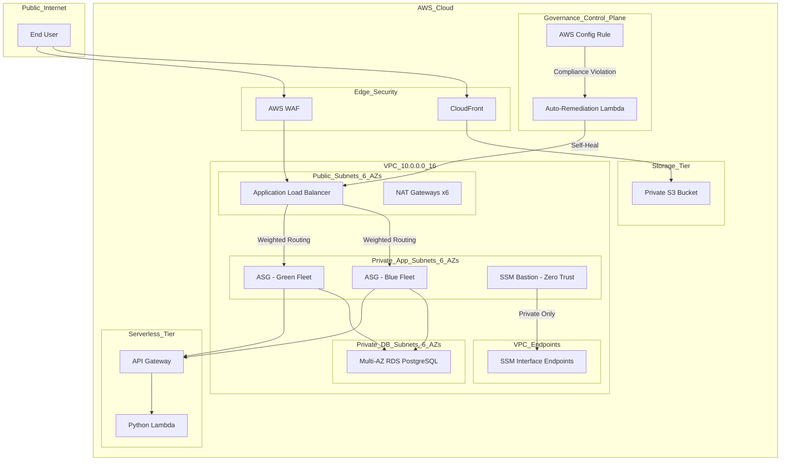

# AWS Hybrid 3-Tier + Serverless Platform (Architect-Level)

This repository demonstrates a **Production-Grade Hybrid Infrastructure** deployed via Terraform. It features a hardened, high-availability architecture that bridges traditional 3-tier web applications with modern serverless components and automated governance.

## 📐 Architecture Diagram

---

## 🚀 Key Architectural Layers

### 1. **High-Availability Networking**
*   **Massive Scale**: Deployed across **6 Availability Zones** with **18 Subnets** total.
*   **Redundancy**: Each AZ has its own dedicated **NAT Gateway** to eliminate single points of failure for outbound traffic.
*   **CIDR Strategy**: Implemented non-overlapping logical offsets (`+20`, `+40`) to ensure tier isolation and future scalability.

### 2. **Compute & Deployment (Blue/Green)**
*   **Zero-Downtime**: Utilizes two independent Auto Scaling Groups (ASG) behind a single ALB.
*   **Canary Deployment**: ALB is configured with **Weighted Forwarding**, allowing traffic to be shifted incrementally (e.g., 90% to Blue, 10% to Green) for safe testing.
*   **Health Checks**: Custom `/health` endpoint monitoring ensures the ALB only routes traffic to fully initialized instances.

### 3. **Zero-Trust Management Tier**
*   **SSM Bastion**: A private EC2 host with **zero open inbound ports**. 
*   **VPC Interface Endpoints**: Management traffic for SSM and EC2 stays entirely on the AWS backbone, never traversing the public internet.
*   **Hardening**: Metadata service (IMDSv2) is strictly enforced to prevent credential theft.

### 4. **Self-Healing Governance (AWS Config)**
*   **Automated Compliance**: Implemented a **Governance-as-Code** loop.
*   **The Logic**: AWS Config monitors Security Groups. If a user manually opens Port 22 (SSH) to the world, Amazon EventBridge triggers a **Remediation Lambda** that revokes the rule within seconds.

### 5. **FinOps & Cost-Optimization-as-Code**
This project treats cost as a first-class engineering concern, with different logic for **Production** vs. **Non-Production** environments.

#### **Foundational Savings (Implemented)**
*   **Dynamic NAT Scaling**: In `dev`/`staging`, the code automatically scales down from 6 NAT Gateways to **1 shared gateway**, saving **~$180/month**.
*   **Automated Spot Instances**: ASG fleets in non-prod environments utilize **AWS Spot Instances**, reducing compute costs by up to **90%**.
*   **Environment-Aware RDS**: Database deployments automatically shift between **Multi-AZ (High Availability)** for production and **Single-AZ (Cost Saving)** for development.
*   **Managed Log Retention**: Implemented a strict **7-day retention policy** on all CloudWatch Log Groups to prevent infinite storage billing.

#### **Advanced Architectural Efficiency (Implemented)**
*   **VPC Gateway Endpoints**: Implemented free S3 endpoints to eliminate the "NAT Gateway Tax," keeping internal data traffic off expensive managed gateways.
*   **Graviton Standard (ARM64)**: Migrated the entire compute tier to **AWS Graviton (t4g)**, achieving 20% lower hourly costs and 40% better price-performance than legacy x86 instances.
*   **S3 Intelligent-Tiering**: Automated storage class transitions to ensure data is always stored at the lowest possible price point without retrieval fees.

### 6. **Production-Hardened Refinements**
Addresses real-world architectural gaps often missed in portfolio projects:
*   **AWS Secrets Manager**: Database passwords are no longer passed as plain-text variables. Instead, they are stored in Secrets Manager and fetched **at runtime** by the EC2 instances using IAM roles.
*   **Proactive Alerting**: Integrated **CloudWatch Alarms** with **Amazon SNS**. The system automatically notifies engineers if ALB 5XX errors spike or RDS CPU utilization exceeds 80%.
*   **Variable Scaling**: The entire architecture (Subnets, NATs, Routes) is now controlled by a single `az_count` variable, allowing the business to balance High Availability vs. Cost with one line of code.
*   **State Locking (Ready)**: Included a production-ready **Remote S3 Backend** configuration with **DynamoDB State Locking** to prevent state corruption in team environments.
*   **Robust Remediation**: Enhanced the Governance Lambda with detailed logging and error handling for production reliability.

## 🔒 Security Posture
*   **WAF Protected**: All web traffic is filtered by an AWS WAF Web ACL.
*   **Data at Rest**: RDS Deletion Protection enabled; S3 Bucket Versioning and Encryption active.
*   **Edge Security**: S3 assets are shielded by CloudFront with **Origin Access Control (OAC)**.

---

## 🛠️ Implementation Details

### Deployment Guide
1.  **Initialize**: `terraform init`
2.  **Configure**: Create `environments/dev.tfvars` based on `example.tfvars`.
3.  **Deploy**: `terraform apply -var-file=environments/dev.tfvars`

### Local Validation
Verified via **Moto Docker** simulating a 124-resource environment. Confirmed all dependency graphs and logic paths.

## 📄 License
This project is licensed under the MIT License - see the `LICENSE` file for details.

---
**Author**: [Kindee18](https://github.com/Kindee18)  
*Architecting for the future of Cloud Engineering.*
